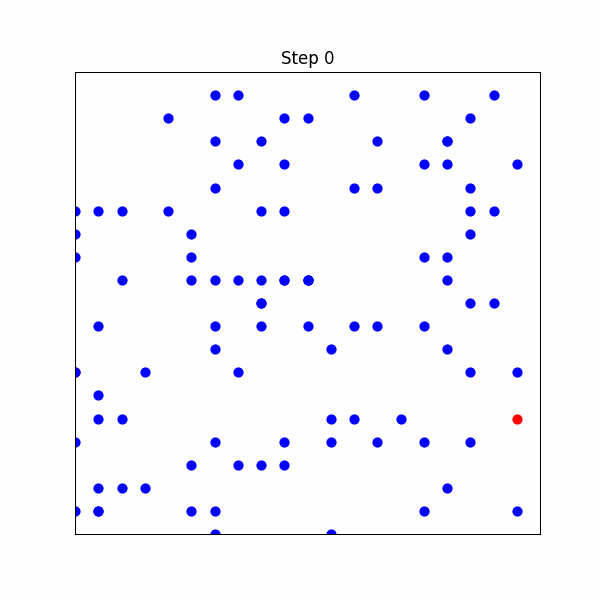
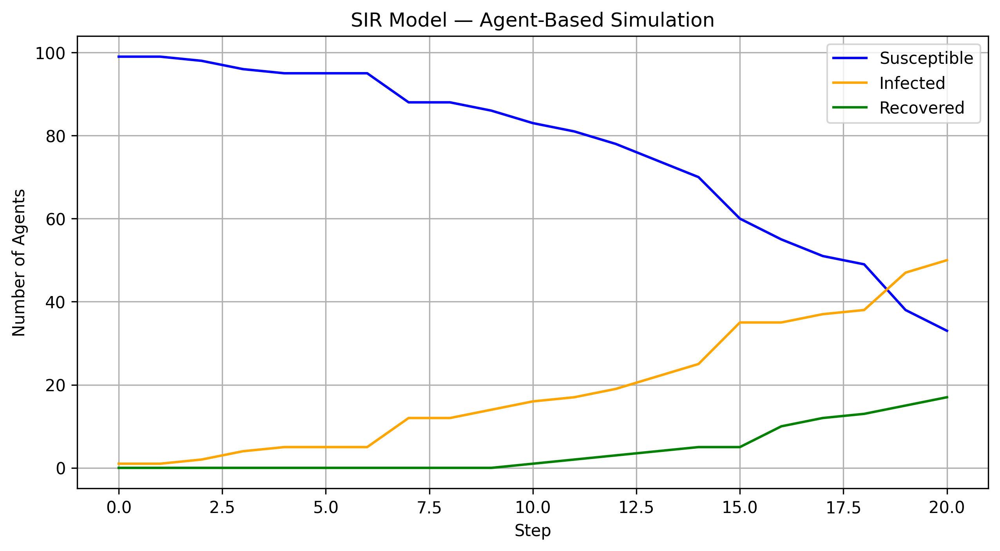

# 🦠 Infection Spread Simulation using Agent-Based Modeling (Mesa + Python)

Simulates the spread of an infectious disease using an **Agent-Based SIR (Susceptible-Infected-Recovered)** model with Python and the [Mesa](https://mesa.readthedocs.io/en/stable/) framework.

Agents move randomly on a grid, infecting nearby individuals based on configurable parameters like infection probability and recovery time. This project includes a dynamic animation of the outbreak and a real-time SIR curve for analysis.

---

## 📸 Simulation Preview

### ▶️ Animated Infection Spread



### 📈 SIR Curve (Susceptible, Infected, Recovered)



---

## 🧠 Key Features

- 💡 **Agent-based logic** for realistic spread modeling
- 📊 **Live SIR data collection** with visualizations
- 🧪 Configurable infection chance and recovery time
- 🔁 Interactive animation using `matplotlib.animation`
- 📦 Lightweight dependencies (only Mesa, Matplotlib, Pandas)

---

## 🛠️ How It Works

Each agent is either:
- 🟦 **Susceptible (S)** — blue
- 🟥 **Infected (I)** — red
- 🟩 **Recovered (R)** — green

At each time step:
1. Infected agents move and attempt to infect neighbors
2. Infected agents track their infection time
3. Once they exceed a threshold, they recover
4. The simulation updates and records states

---

## 🚀 Get Started

### 🧰 Requirements

Install Python dependencies:

```
pip install mesa matplotlib pandas
```
## 🧪 Run the Simulation
1. Clone the repo
```
git clone https://github.com/your-username/infection-simulation-mesa.git
cd infection-simulation-mesa
```
2. Open the notebook
Run ``` infection_model.ipynb ``` using Jupyter Notebook or Jupyter Lab
## 📂 Project Structure
```
infection-simulation-mesa/
├── infection_model.ipynb     # Main simulation code
├── infection_sim.gif         # Grid animation of spread
└── README.md                 # You're here
```
## 📌 Possible Extensions
- 💉 Vaccinated or immune agents

- 🚫 Lockdown zones or movement restrictions

- 🧬 Variable infection strengths or mutation modeling

- 🧑‍⚕️ Contact tracing or network spread

## 👋 About Me
👨‍💻 Built by Paritosh Gandre — Data Science enthusiast focused on AI for public health and decision intelligence.

## 🌟 Star this repo if you found it helpful!
